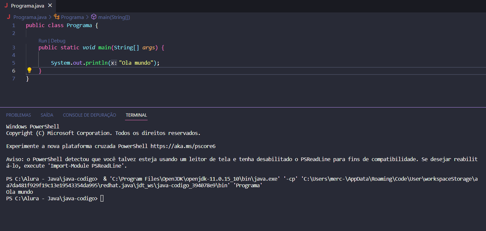

#  Curso de Java JRE e JDK: compile e execute o seu programa

### Faça esse curso de Java e:

- JVM? JDK? JRE? O que são essas siglas?

- Compilando e executando código java

- Aprenda a usar Eclipse

- Variáveis e controle de fluxo

- Conheça os principais tipos do Java

Instrutor: Paulo Silveira 
___________

Nessa aula você escreveu o seu primeiro código Java e aprendemos:

- qual é a diferença entre JRE e JDK

- como compilar um código fonte Java na linha de comando (**javac**)

- como executar o Bytecode na linha de comando (**java**)

- um programa Java deve estar escrito dentro de uma classe (**class**)

- toda instrução Java deve ser finalizada com **;**

- para abrir e fechar um bloco usaremos as chaves **{}**

- um programa Java possui uma entrada que é uma função (método) **main**

- para imprimir algo no console usamos a instrução **System.out.println()**

**Primeiro programa "Ola mundo"**

