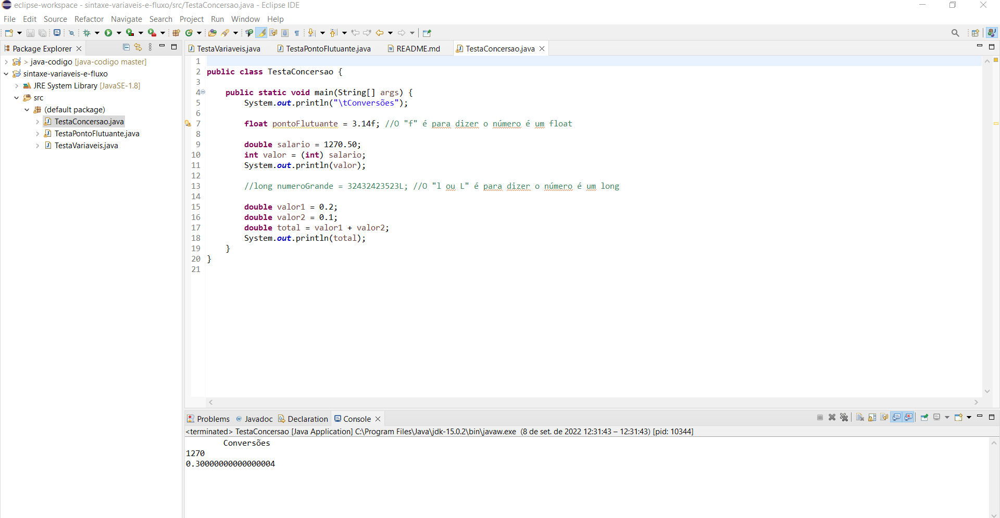
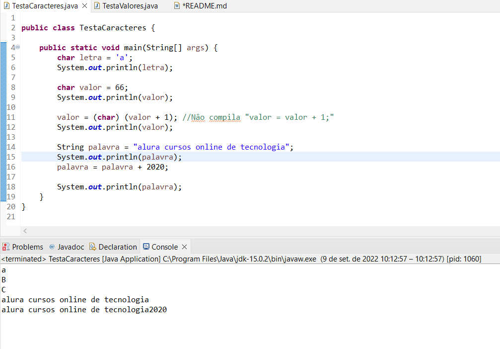

#  Curso de Java JRE e JDK: compile e execute o seu programa

### Faça esse curso de Java e:

- JVM? JDK? JRE? O que são essas siglas?

- Compilando e executando código java

- Aprenda a usar Eclipse

- Variáveis e controle de fluxo

- Conheça os principais tipos do Java

Instrutor: Paulo Silveira 
___________

Nessa aula você escreveu o seu primeiro código Java e aprendemos:

- qual é a diferença entre JRE e JDK

- como compilar um código fonte Java na linha de comando (**javac**)

- como executar o Bytecode na linha de comando (**java**)

- um programa Java deve estar escrito dentro de uma classe (**class**)

- toda instrução Java deve ser finalizada com **;**

- para abrir e fechar um bloco usaremos as chaves **{}**

- um programa Java possui uma entrada que é uma função (método) **main**

- para imprimir algo no console usamos a instrução **System.out.println()**

**Primeiro programa "Ola mundo"**

### 03. Começando com IDE

**Este capítulo apresentou:**

- O papel de um IDE e sua diferença de um editor

- Como fazer o download do Eclipse IDE

- Para que serve um workspace

- O conceito de perspectiva

- Como criar um projeto Java, inclusive classes e como executá-lo.

- Como exibir diferentes views

### 04. Tipos de variáveis

**O que aprendemos?**

Nesta aula iniciamos nosso aprendizado com variáveis e tipos primitivos do Java. Os tipos vistos com mais detalhe foram int (inteiro) e double (decimal). Que usamos para fazer operações aritméticas e também concatenar com texto.

Durante o capítulo falamos sobre boas práticas na hora de nomear classes e também variáveis. Iniciamos as classes com letra maiúscula e as nossas funções e variáveis com letras minúsculas. 

Foi possível entender um pouco de type casting e como podemos passar um valor de um tipo para uma variável de outro. Para alguns casos nós não precisamos fazer nada, pois o casting é implícito e em outros precisamos deixar claro para o compilador que sabemos o que estamos fazendo, mostrando entre parênteses o tipo que queremos que seja usado.

### 05. Trabalhando com caracteres 

**Este capítulo apresentou:**

- O conceito e como declarar char e String

- Como concatenar Strings

- Atalho para criação da main

- Variáveis guardam valores e não referências.

### 06. Praticando condicionais

Nessa aula, aprendemos:

- como usar o **if**

- como usar as operações lógicas AND (**&&**) e OR (**||**)

- trabalhar com o escopo de variáveis

Também já vimos alguns atalhos no Eclipse:

- main + ctrl + espaço
  - para gerar o método main

- **ctrl + shift + f**
  - para formatar o código fonte

- **sysout + ctrl + espaço**
  - para gerar a instrução **System.out.println()**

### 07. Controlando fluxo com laços   